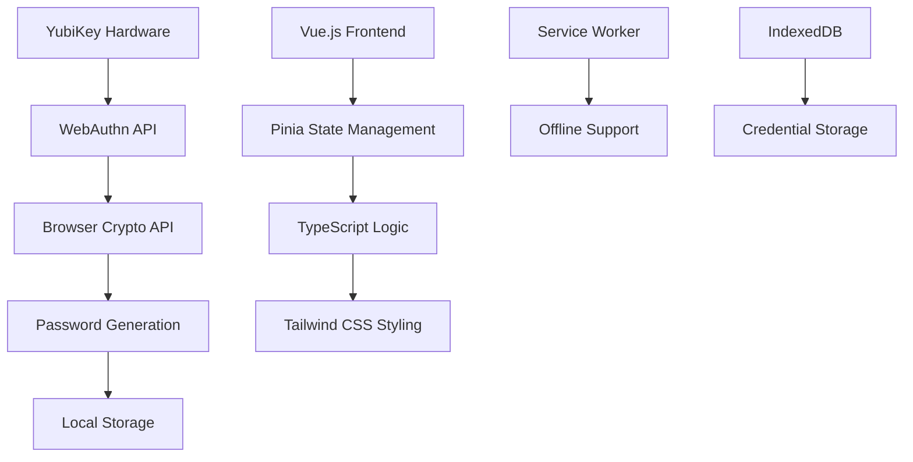

<div align="center">
  
  
  # YubiKey Security Toolkit
  
  **Browser-based password generator using WebAuthn/FIDO2**
  
  *Developed by [handahl labs](https://handahl.org) in collaboration with [bolt.new](https://bolt.new) and [Claude by Anthropic](https://claude.ai)*
  
  [](https://webauthn.guide)
  [](https://www.yubico.com)
  [](https://github.com)
  [](LICENSE.md)
</div>

---

## 🚀 **Overview**

The YubiKey Security Toolkit is a modern, browser-based application that leverages your YubiKey's hardware-backed entropy to generate secure, deterministic passwords. Built with cutting-edge web standards, it provides enterprise-grade security while maintaining complete privacy through local-only data storage.

### ✨ **Key Features**

🔐 **Hardware-Backed Security**
- Uses YubiKey's tamper-resistant hardware for entropy generation
- WebAuthn/FIDO2 integration for standardized authentication
- No passwords stored - everything generated deterministically

🎯 **Smart Password Management**
- Service-specific 20-character passwords
- Version control for compromised passwords
- Domain intelligence (extracts `example` from `sub.example.com`)
- Consistent output across sessions

🌙 **Modern User Experience**
- Dark mode by default with adaptive themes
- Responsive design for all devices
- Offline-capable Progressive Web App
- Intuitive clipboard integration

🔒 **Privacy-First Design**
- Zero telemetry or external dependencies
- All data stored locally in your browser
- No server communication required
- Open source and auditable

📅 **Advanced Utilities**
- XOR-based date encoding system
- Compact 5-character date representations
- Reversible encoding with year-dependent operations

---

## 🏗️ **Architecture**



### **Technology Stack**

**Frontend Framework**
- Vue.js 3 with Composition API
- TypeScript for type safety
- Vite for lightning-fast development

**Styling & UI**
- Tailwind CSS with dark mode support
- Custom component library
- Responsive design patterns

**Security & Crypto**
- WebAuthn/FIDO2 APIs
- Web Crypto API for hashing
- Hardware-backed entropy generation

**State Management**
- Pinia for reactive state
- LocalStorage persistence
- Optimistic UI updates

---

## 🛠️ **Installation & Setup**

### **Prerequisites**
- Modern browser with WebAuthn support (Chrome 67+, Firefox 60+, Safari 14+)
- YubiKey with FIDO2/WebAuthn capability
- HTTPS connection (required for WebAuthn)

### **Quick Start**

```bash
# Clone the repository
git clone https://github.com/handahl-labs/yubikey-security-toolkit.git
cd yubikey-security-toolkit

# Install dependencies
npm install

# Start development server
npm run dev

# Build for production
npm run build
```

### **YubiKey Configuration**

No additional YubiKey configuration required! The application uses WebAuthn's standard registration flow:

1. **Insert your YubiKey**
2. **Open the application** in a supported browser
3. **Register your YubiKey** through the web interface
4. **Start generating passwords** immediately

---

## 📖 **Usage Guide**

### **Password Generation**

1. **Register YubiKey**: Click "Register YubiKey" and follow the prompts
2. **Enter Service**: Type a domain or service name (e.g., `github.com`)
3. **Generate Password**: Click "Generate" to create a 20-character password
4. **Version Control**: Use "New Version" if a password is compromised

### **Date Encoding**

1. **Navigate to Date Encoder** tab
2. **Enter Date**: Use format `DD.MM.YYYY` or `DD.MM.YY`
3. **Get Encoded Result**: Receive a 5-character encoded string
4. **Decode**: Reverse the process with the encoded string and reference year

### **Settings Management**

- **Theme Control**: Switch between light, dark, and adaptive modes
- **Credential Management**: Add/remove multiple YubiKeys
- **Data Export**: Download your settings and password history
- **Privacy Controls**: Clear history and manage local data

---

## 🔐 **Security Model**

### **Threat Model**

**Protected Against:**
- Password reuse across services
- Weak password generation
- Server-side data breaches
- Man-in-the-middle attacks
- Credential stuffing attacks

**Assumptions:**
- YubiKey hardware integrity
- Browser security model
- Local device security
- HTTPS transport security

### **Cryptographic Design**

```typescript
// Password Generation Algorithm
const entropy = await getWebAuthnEntropy(credentialId, challenge)
const serviceBytes = new TextEncoder().encode(serviceName)
const versionBytes = new TextEncoder().encode(`v${version}`)
const seedData = concat(entropy, serviceBytes, versionBytes)
const hash = await crypto.subtle.digest('SHA-256', seedData)
const password = generateFromHash(hash, 20) // 20 characters
```

### **Privacy Guarantees**

- **No External Communication**: All operations happen locally
- **No Telemetry**: Zero data collection or analytics
- **No Tracking**: No user identification or behavior monitoring
- **Local Storage Only**: Data never leaves your device

---

## 🧪 **Testing**

```bash
# Run unit tests
npm run test

# Run tests with coverage
npm run test:coverage

# Run tests in watch mode
npm run test:watch
```

### **Test Coverage**

- ✅ WebAuthn credential management
- ✅ Password generation algorithms
- ✅ Date encoding/decoding functions
- ✅ Theme switching and persistence
- ✅ Error handling and edge cases

---

## 🚀 **Deployment**

### **Static Hosting**

The application builds to static files and can be deployed to any static hosting service:

```bash
# Build for production
npm run build

# Deploy to your preferred platform
# - Netlify
# - Vercel
# - GitHub Pages
# - AWS S3 + CloudFront
```

### **HTTPS Requirement**

WebAuthn requires HTTPS in production. Ensure your hosting platform provides SSL certificates.

### **Content Security Policy**

Recommended CSP headers for enhanced security:

```
Content-Security-Policy: default-src 'self'; script-src 'self'; style-src 'self' 'unsafe-inline'; img-src 'self' data:; connect-src 'self'
```

---

## 🤝 **Contributing**

We welcome contributions from the community! Please read our [Contributing Guidelines](CONTRIBUTING.md) before submitting pull requests.

### **Development Workflow**

1. **Fork** the repository
2. **Create** a feature branch (`git checkout -b feature/amazing-feature`)
3. **Commit** your changes (`git commit -m 'Add amazing feature'`)
4. **Push** to the branch (`git push origin feature/amazing-feature`)
5. **Open** a Pull Request

### **Code Standards**

- TypeScript for all new code
- ESLint + Prettier for formatting
- Comprehensive test coverage
- Security-first development practices

---

## 📋 **Roadmap**

See our detailed [Roadmap](docs/ROADMAP.md) for upcoming features and improvements.

**Next Milestones:**
- 🔄 **Q2 2025**: Enhanced WebAuthn integration
- 📱 **Q3 2025**: Mobile PWA optimization  
- 🏢 **Q4 2025**: Enterprise features
- 🌐 **Q1 2026**: Multi-language support

---

## 📄 **License**

This project is licensed under the GNU General Public License v3.0 - see the [LICENSE.md](LICENSE.md) file for details.

---

## 🙏 **Acknowledgments**

### **Collaboration Partners**

- **[handahl labs](https://handahl.org)** - Primary development and architecture
- **[bolt.new](https://bolt.new)** - Development platform and tooling
- **[Claude by Anthropic](https://claude.ai)** - AI-assisted development and optimization

### **Technology Credits**

- **[Yubico](https://www.yubico.com)** - YubiKey hardware and FIDO2 standards
- **[W3C WebAuthn](https://www.w3.org/TR/webauthn/)** - Authentication specifications
- **[Vue.js Team](https://vuejs.org)** - Frontend framework
- **[Tailwind CSS](https://tailwindcss.com)** - Utility-first CSS framework

---

## 📞 **Support**

- **🐛 Bug Reports**: [GitHub Issues](https://github.com/handahl-labs/yubikey-security-toolkit/issues)
- **💡 Feature Requests**: [GitHub Discussions](https://github.com/handahl-labs/yubikey-security-toolkit/discussions)
- **📧 Security Issues**: security@handahl.org
- **📖 Documentation**: [Wiki](https://github.com/handahl-labs/yubikey-security-toolkit/wiki)

---

<div align="center">
  <p><strong>Built with ❤️ by handahl labs</strong></p>
  <p><em>Securing the web, one password at a time.</em></p>
  
  [](https://handahl.org)
  [](https://bolt.new)
  [](https://claude.ai)
</div>

---

<div align="center">
  <p><em>developed with european-❤️ in Taiwan</em></p>
</div>