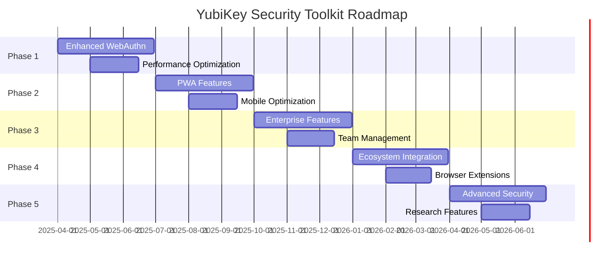

<div align="center">
  
  
  # YubiKey Security Toolkit - Roadmap
  
  *Developed by [Handahl Labs](https://handahl.com) in collaboration with [Bolt.new](https://bolt.new) and [Claude by Anthropic](https://claude.ai)*
</div>

---

## 🎯 **Vision Statement**

Transform the YubiKey Security Toolkit into the definitive cross-platform solution for hardware-backed password management, leveraging modern web standards for maximum accessibility while maintaining enterprise-grade security guarantees.

---

## 🚀 **Phase 1: Enhanced WebAuthn Foundation** *(Q2 2025)*

### 🌐 **Advanced WebAuthn/FIDO2 Integration**
**Goal**: Maximize WebAuthn capabilities and hardware security features

#### **Core Enhancements**
- **🔐 Multi-Credential Support**
  - Support for multiple YubiKeys per user
  - Primary/backup key configurations
  - Automatic failover between devices
  - Cross-device synchronization of service lists

- **⚡ Performance Optimization**
  - Sub-100ms password generation
  - Optimized cryptographic operations
  - Efficient entropy caching
  - Background credential validation

- **🛡️ Enhanced Security Features**
  - User verification options (PIN, biometric)
  - Attestation validation and reporting
  - Hardware security module detection
  - Tamper evidence logging

#### **Technical Implementation**
```typescript
// Enhanced WebAuthn entropy with attestation
interface EnhancedWebAuthnConfig {
  userVerification: 'required' | 'preferred' | 'discouraged'
  attestation: 'direct' | 'indirect' | 'enterprise'
  authenticatorSelection: {
    authenticatorAttachment: 'platform' | 'cross-platform'
    requireResidentKey: boolean
    userVerification: UserVerificationRequirement
  }
  extensions: {
    credProps: boolean
    hmacCreateSecret: boolean
    largeBlob: { support: 'required' | 'preferred' }
  }
}
```

---

## 📱 **Phase 2: Progressive Web App Excellence** *(Q3 2025)*

### 🔧 **Native-Like Experience**
**Goal**: Deliver seamless cross-platform functionality with offline capabilities

#### **PWA Features**
- **📴 Offline-First Architecture**
  - Service Worker with intelligent caching
  - Background sync for credential updates
  - Offline password generation capability
  - Progressive enhancement strategies

- **🖥️ Desktop Integration**
  - System tray integration (Windows/macOS/Linux)
  - Global hotkeys for quick access
  - Native file system access for exports
  - OS-level credential management integration

- **📱 Mobile Optimization**
  - Touch-optimized interface
  - Haptic feedback integration
  - Mobile-specific WebAuthn flows
  - App-like navigation patterns

#### **Platform-Specific Features**
```typescript
// Platform detection and optimization
interface PlatformCapabilities {
  hasSystemTray: boolean
  supportsGlobalHotkeys: boolean
  hasNativeFileSystem: boolean
  supportsHapticFeedback: boolean
  webAuthnPlatformSupport: 'full' | 'partial' | 'none'
}

// Adaptive UI based on platform
const adaptUIForPlatform = (capabilities: PlatformCapabilities) => {
  return {
    showSystemTrayOption: capabilities.hasSystemTray,
    enableGlobalHotkeys: capabilities.supportsGlobalHotkeys,
    useNativeFilePicker: capabilities.hasNativeFileSystem,
    enableHaptics: capabilities.supportsHapticFeedback
  }
}
```

---

## 🏢 **Phase 3: Enterprise & Team Features** *(Q4 2025)*

### 🛡️ **Professional Workflows**
**Goal**: Support business environments and team collaboration

#### **Enterprise Features**
- **👥 Team Management**
  - Shared service configurations
  - Team credential policies
  - Centralized audit logging
  - Role-based access controls

- **📊 Compliance & Reporting**
  - GDPR/SOX compliance tools
  - Detailed audit trails
  - Password policy enforcement
  - Security event monitoring

- **🔄 Advanced Password Policies**
  - Custom character sets and lengths
  - Temporal rotation schedules
  - Complexity requirements
  - Industry-specific templates

#### **Team Collaboration Architecture**
```typescript
interface TeamConfiguration {
  teamId: string
  policies: {
    passwordPolicy: PasswordPolicy
    rotationSchedule: RotationSchedule
    auditRequirements: AuditConfig
    complianceStandards: ComplianceStandard[]
  }
  members: TeamMember[]
  sharedServices: SharedService[]
}

interface SharedService {
  serviceName: string
  sharedWith: string[] // Team member IDs
  accessLevel: 'read' | 'generate' | 'admin'
  lastModified: Date
  modifiedBy: string
}
```

---

## 🌍 **Phase 4: Ecosystem Integration** *(Q1 2026)*

### 🔗 **Third-Party Integrations**
**Goal**: Seamless integration with existing password management ecosystems

#### **Integration Features**
- **🔄 Password Manager Sync**
  - 1Password integration
  - Bitwarden compatibility
  - LastPass migration tools
  - KeePass export/import

- **🏢 Enterprise Identity Systems**
  - Active Directory integration
  - LDAP authentication
  - SAML/OIDC support
  - Azure AD compatibility

- **🌐 Browser Extensions**
  - Chrome/Firefox/Safari extensions
  - Auto-fill capabilities
  - Context menu integration
  - Secure communication with main app

#### **API Ecosystem**
```typescript
// Standardized integration API
interface PasswordManagerIntegration {
  provider: 'onepassword' | 'bitwarden' | 'lastpass' | 'keepass'
  
  export(): Promise<ExportData>
  import(data: ImportData): Promise<ImportResult>
  sync(): Promise<SyncStatus>
  
  // Bidirectional sync capabilities
  onServiceAdded(callback: (service: Service) => void): void
  onPasswordGenerated(callback: (password: GeneratedPassword) => void): void
}

// Browser extension messaging
interface ExtensionMessage {
  type: 'generate-password' | 'get-services' | 'update-service'
  payload: any
  origin: string
  timestamp: number
}
```

---

## 🔬 **Phase 5: Advanced Security Research** *(Q2 2026)*

### 🛡️ **Next-Generation Security**
**Goal**: Pioneer advanced cryptographic techniques and security research

#### **Research Areas**
- **🔮 Post-Quantum Cryptography**
  - Quantum-resistant algorithms
  - Hybrid classical/quantum approaches
  - Migration strategies for existing data
  - Performance optimization

- **🧠 AI-Powered Security**
  - Anomaly detection for credential usage
  - Intelligent password policy recommendations
  - Automated security assessment
  - Behavioral analysis for fraud detection

- **🔐 Zero-Knowledge Architectures**
  - Client-side encryption for team features
  - Zero-knowledge proof systems
  - Decentralized identity integration
  - Privacy-preserving analytics

#### **Experimental Features**
```typescript
// Post-quantum cryptography integration
interface PostQuantumConfig {
  algorithm: 'kyber' | 'dilithium' | 'falcon' | 'sphincs'
  keySize: number
  hybridMode: boolean // Combine with classical crypto
  migrationStrategy: 'gradual' | 'immediate' | 'on-demand'
}

// AI-powered security insights
interface SecurityInsights {
  riskScore: number
  recommendations: SecurityRecommendation[]
  anomalies: SecurityAnomaly[]
  trends: SecurityTrend[]
}
```

---

## 📊 **Success Metrics & KPIs**

### **Technical Performance**
- **⚡ Speed**: Password generation < 100ms (95th percentile)
- **🔒 Security**: Zero credential leakage incidents
- **📱 Compatibility**: 95%+ browser/device support
- **⏱️ Uptime**: 99.9% availability for offline features

### **User Experience**
- **👥 Adoption**: 10,000+ active users by end of 2025
- **⭐ Satisfaction**: 4.5+ star rating across platforms
- **♿ Accessibility**: WCAG 2.1 AA compliance
- **🌍 Reach**: Support for 10+ languages

### **Security & Compliance**
- **🛡️ Audits**: Annual third-party security audits
- **📋 Standards**: FIDO Alliance certification
- **🏢 Enterprise**: 100+ enterprise deployments
- **🔍 Transparency**: Public security documentation

### **Community & Ecosystem**
- **🤝 Contributions**: 50+ community contributors
- **🔌 Integrations**: 20+ third-party integrations
- **📚 Documentation**: Complete API and user documentation
- **🎓 Education**: Security awareness content and training

---

## ⚠️ **Risk Mitigation Strategies**

### **Technical Risks**
| Risk | Impact | Probability | Mitigation |
|------|--------|-------------|------------|
| Browser compatibility issues | High | Medium | Progressive enhancement, extensive testing |
| WebAuthn standard changes | Medium | Low | Active participation in standards bodies |
| Performance degradation | Medium | Medium | Continuous benchmarking, optimization |
| Security vulnerabilities | High | Low | Regular audits, bug bounty program |

### **Market Risks**
| Risk | Impact | Probability | Mitigation |
|------|--------|-------------|------------|
| Competing solutions | Medium | High | Focus on unique value proposition |
| Regulatory changes | High | Medium | Proactive compliance monitoring |
| Technology obsolescence | High | Low | Modular architecture, standards-based |
| User adoption challenges | Medium | Medium | Comprehensive onboarding, documentation |

### **Operational Risks**
| Risk | Impact | Probability | Mitigation |
|------|--------|-------------|------------|
| Key team member departure | Medium | Medium | Knowledge documentation, cross-training |
| Infrastructure failures | Low | Low | Distributed architecture, redundancy |
| Supply chain attacks | High | Low | Dependency auditing, security scanning |
| Legal/IP issues | Medium | Low | Legal review, open source compliance |

---

## 🎯 **Long-term Vision** *(2026+)*

### **Industry Leadership**
- **📜 Standards Contribution**: Active participation in W3C, FIDO Alliance
- **🔬 Research Publications**: Academic papers on hardware-backed security
- **🏆 Industry Recognition**: Awards for security innovation
- **🎤 Conference Presence**: Speaking engagements at major security conferences

### **Platform Evolution**
- **🌐 Decentralized Identity**: W3C DID integration
- **🔗 Blockchain Integration**: Immutable audit trails
- **🤖 AI Security Assistant**: Intelligent security recommendations
- **🌍 Global Standards**: Influence next-generation authentication standards

### **Ecosystem Expansion**
- **📱 Native Mobile SDKs**: iOS/Android development libraries
- **🏠 IoT Integration**: Smart home and embedded device support
- **☁️ Cloud Services**: Optional cloud sync with zero-knowledge encryption
- **🎓 Educational Platform**: Security training and certification programs

---

## 📅 **Detailed Timeline**



---

## 🤝 **Partnership Strategy**

### **Technology Partners**
- **Yubico**: Hardware integration and certification
- **Browser Vendors**: WebAuthn implementation feedback
- **Security Vendors**: Integration partnerships
- **Cloud Providers**: Deployment and scaling support

### **Academic Collaborations**
- **Universities**: Security research partnerships
- **Research Labs**: Cryptographic algorithm development
- **Standards Bodies**: Active participation and contribution
- **Security Communities**: Open source collaboration

### **Enterprise Partnerships**
- **System Integrators**: Enterprise deployment support
- **Consulting Firms**: Implementation and training services
- **Compliance Vendors**: Regulatory requirement mapping
- **Identity Providers**: SSO and federation integration

---

<div align="center">
  
## 🚀 **Ready to Shape the Future of Security?**

*This roadmap represents our commitment to advancing hardware-backed security through innovative web technologies. Built on the foundation of collaboration between Handahl Labs, Bolt.new, and Claude by Anthropic, we're creating the next generation of password security tools.*

**Join us in securing the digital world, one password at a time.**

[](https://handahl.com)
[](https://bolt.new)
[](https://claude.ai)

</div>